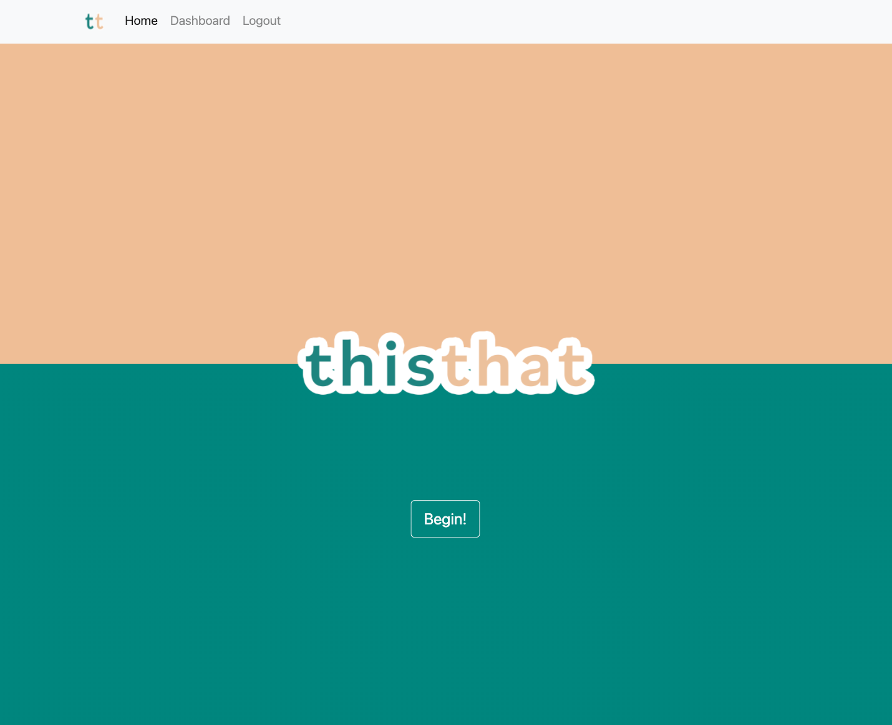
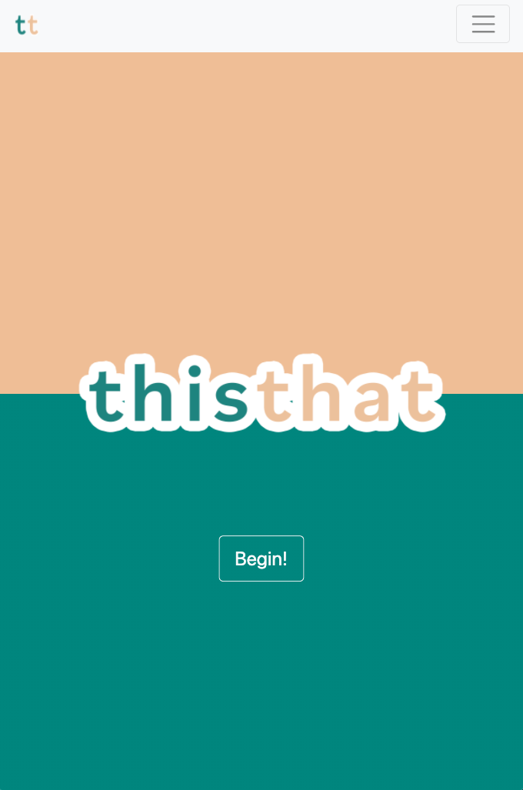
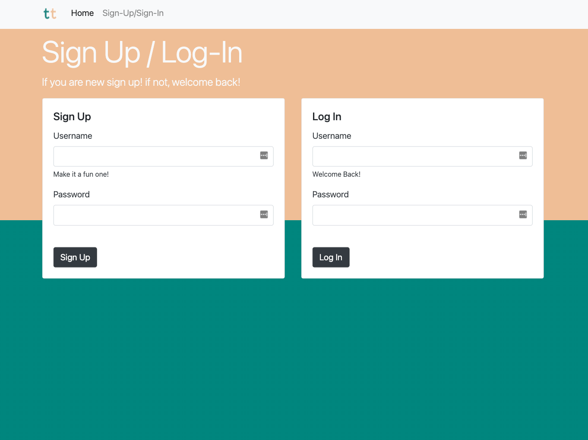
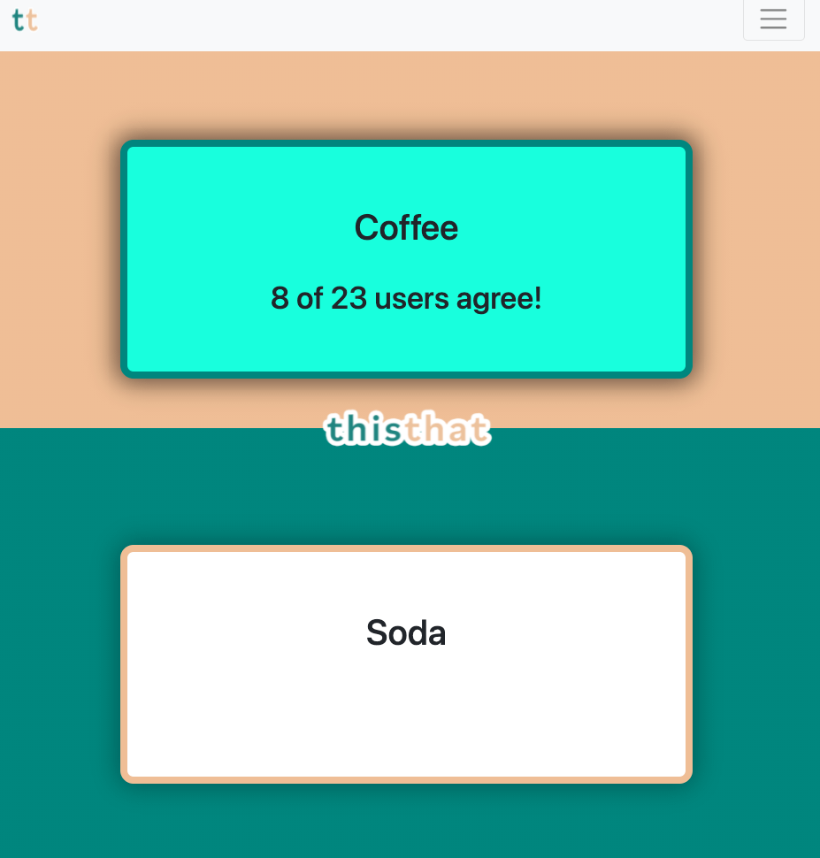
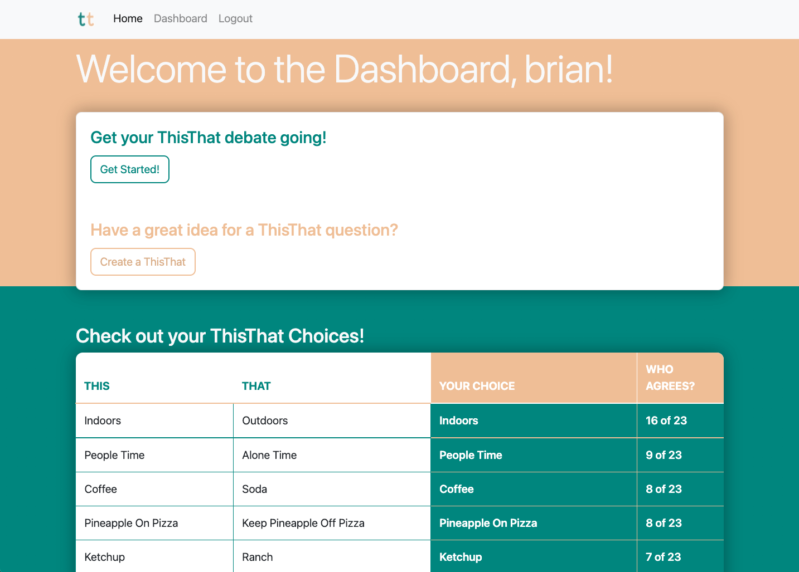

# ThisThat

https://this--that.herokuapp.com/

## Description
For many in this modern era, "Hanging Out" has turned sitting around a table together, each individual focused on their own phone rather than engaged with others in thier midst. ThisThat steps in to turn that scenario into an engaging social environment. While sitting together, users of ThisThat can engage in thoughtful debate with one another with the guidance of ThisThat prompts, while a solo user can engage in internal debate and see where they stand in agreement with other users. So, which will it be for you? This, or That? --ThisThat.

In creating this application, the following technologies were used:
- HTML/CSS
- Bootstrap
- JavaScript
- Node.js (with bcrypt, connect-session-sequelize, dotenv, express-handlebars, express session, and mysql2 packages in addition to others listed as primary technologies)
- Express
- MySQL/Sequelize
- Handlebars.js
- Basictable JS library by Jerry Low

## Table of Contents
* [Installation](#installation)
* [Usage](#usage)
* [Credits](#credits)
* [License](#license)
* [Future Development](#futuredevelopment)
* [Contributing](#contributing)
* [Tests](#tests)
* [Questions](#questions)

## Installation
To interact with this application without running your own server on your local machine, use the deployed link and reference the usage information below. 

For personal/local use, use the command 'git clone' in your command line with the link of this repo while navigated to your desired directory to copy this repo to your machine. Run 'npm install' or 'npm i' in your command line in the root folder of this application to install dependencies required (bcrypt, connect-session-sequelize, dotenv, express, express-handlebars, express-session, handlebars, mysql2, sequelize). (note: it is not recommended to update the version of these dependencies, in order to ensure maximum compatability)

## Usage

#### Using ThisThat through the deployed link:
1. When you navigate to the homepage at this--that.herokuapp.com, click the "sign-in/sign-up" button. Proceed to log in, or sign up for the first time. You must be signed in to interact with ThisThat questions.
2. When you log in, you will be redirected to the dashboard. Here, you can submit a ThisThat pair for other users to interact with, view your saved choices, or begin choosing from ThisThat questions.
3. To submit a ThisThat question, be sure you have BOTH a This and a That in the form to submit a ThisThat. Your submitted question will be added to the end of the list of ThisThat questions, which you will see at the end of interacting with ThisThat questions.
4. From the homepage or the dashboard, select begin to start interacting with ThisThat questions. You will then be presented with 2 options (This, or That) to choose from. Select the one you like/agree with most! The amount to which others agree with you will be displayed after your selection, and the next question will automatically populate after a couple of seconds. 
5. At the end of the question process, or at any time through the "dashboard" link, you can visit your dashboard to view your history of ThisThat selections and how that compares to other users!

#### Using ThisThat on your local machine:
1. To use your own database and server, create a .env file to store and protect your credentials. reference the config/connection.js set up for variables to include in your env file.
2. If you'd like to start with a basis of questions and user input, use these steps to populate the ThisThat database. (Alternatively, you can fill out the forms on the front-end to populate your database with ThisThat questions and choices.)
    * In your command line while in the root folder of the application, login to the mysql shell using the command 'mysql -u root -p'. If you are using a different mysql user specify that in place of root. You'll insert your password after executing this command.
    * Run 'SOURCE db/schema.sql' to start with a fresh database called this_that_db. Then exit the mysql shell using 'quit;'
    * Add any additional data you'd like to the seeds.sql file.
    * Run 'npm start' to start the server and initialize the models for table data. (this is important before the seeds file runs so that sequelize-specific data such as timestamps are created)
    * Use control-c to close the server, then 'mysql -u root -p' to login to mysql shell again. 
    * Run 'SOURCE db/seeds.sql' to seed your data. then quit; to close out of mysql shell.
    * Your data should now be populated in the database!
3. While still in the application root folder, run the command 'npm start' to initiate the application.
6. Locally, visit http://localhost:3001 in your browser to access the app. You can now get your ThisThat on!

### Deployed link and Screenshots
(https://this--that.herokuapp.com/)

## Credits
This was a team effort! Through code pairing, individual and collective efforts, these awesome individuals made this happen:
* Brian Wilde (https://github.com/bgswilde) 
* George Mendoza (https://github.com/georgedmendoza)
* Isaiah Negron (https://github.com/IsaiahNegron)
* Will Haas (https://github.com/Will2tall)

## License

### MIT LICENSE

Permission is hereby granted, free of charge, to any person obtaining a copy
of this software and associated documentation files (the "Software"), to deal
in the Software without restriction, including without limitation the rights
to use, copy, modify, merge, publish, distribute, sublicense, and/or sell
copies of the Software, and to permit persons to whom the Software is
furnished to do so, subject to the following conditions:

The above copyright notice and this permission notice shall be included in all
copies or substantial portions of the Software.

THE SOFTWARE IS PROVIDED "AS IS", WITHOUT WARRANTY OF ANY KIND, EXPRESS OR
IMPLIED, INCLUDING BUT NOT LIMITED TO THE WARRANTIES OF MERCHANTABILITY,
FITNESS FOR A PARTICULAR PURPOSE AND NONINFRINGEMENT. IN NO EVENT SHALL THE
AUTHORS OR COPYRIGHT HOLDERS BE LIABLE FOR ANY CLAIM, DAMAGES OR OTHER
LIABILITY, WHETHER IN AN ACTION OF CONTRACT, TORT OR OTHERWISE, ARISING FROM,
OUT OF OR IN CONNECTION WITH THE SOFTWARE OR THE USE OR OTHER DEALINGS IN THE
SOFTWARE.

## Future Development
We have targeted several things that would improve the ThisThat experience! Here are the things we anticipate improving:
* Ability to switch ThisThat choices through the dashboard
* Ability to view a random ThisThat, omitting questions previously chosen
* Category breakdowns, so ThisThat questions are grouped based on topic/interest
* Filtering the content of new ThisThat question submissions, not allowing questions that are too similar to existing questions or questions that have content that is not family friendly.

## Contributing
No contributing guidelines currently

## Tests
No tests at this time

## Questions
You can find my GitHub profile at https://github.com/bgswilde
For any further questions, reach out to me via email at bgswilde@gmail.com.
